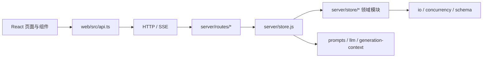

# 自动小说盒子架构索引

本文是当前架构的入口。历史实施计划只用于追溯，不作为新增代码的放置依据。

## 依赖方向

依赖只能沿箭头方向流动：

- 路由只调用 `server/store.js` 门面，不直接导入 `server/store/*`。
- 存储领域模块不能反向导入 `server/store.js`，动态数据根通过依赖注入获取。
- 页面和组件只调用 `web/src/api.ts`，不绑定 `api-sse.ts` 或 `api-contract.ts`。
- `data/` 是运行时用户数据，不属于源码；结构重构不得迁移、重写或清理它。

## 目录入口

| 区域 | 索引 | 职责 |
| --- | --- | --- |
| 服务端 | [server/README.md](./server/README.md) | HTTP 装配、模型调用、领域 schema 与存储门面 |
| 存储内部 | [server/store/README.md](./server/store/README.md) | 原子 I/O、事务、备份、记忆、发布和回收站 |
| 路由 | [server/routes/README.md](./server/routes/README.md) | HTTP 合同与取消传播 |
| 服务端测试 | [server/test/README.md](./server/test/README.md) | 按领域组织的 Node 测试 |
| 前端 | [web/src/README.md](./web/src/README.md) | React 入口、工作流、API 门面和纯状态工具 |
| 组件 | [web/src/components/README.md](./web/src/components/README.md) | 页面区域与可复用交互组件 |
| 文档 | [docs/README.md](./docs/README.md) | 产品方向、当前路线图和历史设计记录 |

## 文件规模规则

- 人工维护的源码、测试、脚本、样式、JSON 配置和 Markdown：硬上限 1500 行。
- 建议线是 800 行；超过后应在所属目录索引中保持单一职责，并在下一次相关改动时优先拆分。
- 不得通过压缩代码、合并多条语句、删除必要注释或复制公共逻辑来“过线”。
- 自动门禁位于 `server/test/architecture.test.js`，会递归扫描项目并检查依赖方向。

显式例外只有：

- `package-lock.json` 与 `web/package-lock.json`：npm 生成的依赖锁文件，不能人工分片。
- `certs/corp-ca.pem`：外部证书链资产，拆分会改变 TLS 信任输入。
- `node_modules/`、`web/node_modules/`、`web/dist/`、`data/` 和 `*.tsbuildinfo`：依赖、构建缓存、构建产物或运行时数据，不属于人工源码。

新增例外必须同时修改本文件与架构测试，并说明为什么文件不可分割；不能只扩大阈值。

## 提示词原则：context not control

发给模型的内容分两类，不能混：

- **正确性硬约束**：连续性、已发布事实、知识边界。写错就是 bug，会让后续几十章的
  因果和悬念作废，因此以硬约束表述。
- **创作判断**：所有关于“怎么写才好看”的内容。一律提供事实、原因和判断依据，
  并显式说明可以按本章需要取舍，不写成逐条打勾的清单。

模型为了避免违规而产出的安全文本，恰好就是读者说的“AI 味”：篇幅收缩、密度均匀、
只剩“谁说了什么、谁决定了什么”。新增提示词内容前先确认它属于哪一类；
属于第二类却写成禁令的，应改为解释原因。

同样地，门槛应当**标注而不是拒绝**：作者策划留白时把未决判断交给模型，
圣经偏短或漏栏时照常落盘并显示诊断。版本链可回退，拒绝落盘只会让作者
白付一次 API 且什么都拿不到。只有输出格式损坏和后台信息泄漏仍然硬拦。

预算也遵循同一条原则。各字段上限之和已经越过模型输入硬上限，因此单次调用必须先经
`context-budget.js` 按优先级分配总额，被裁剪的层在提示词里显式标注“未发送不等于不存在”。
上下文超额不得作为拒绝理由：作者写到第三百章时被要求“精简设定”是不可操作的。

同理，确定性统计（如 `chapter-prose-metrics.js`）用于**补足模型看不到的信息**——
它没有跨章记忆，看不见自己在缩水。这类信息作为上下文提供，不作为门槛拒绝正文。

## 新代码放置决策

| 变化 | 放置位置 |
| --- | --- |
| 新 HTTP 参数、状态码、响应格式 | 对应 `server/routes/*.js`，业务写入仍委托 store 门面 |
| 新的跨文件存储事务 | 独立 `server/store/*.js` 工厂，由 `store.js` 组装 |
| 数据规范化或边界 | 对应 `*-schema.js` 或 `limits.js` |
| 单次调用的分层预算分配与降级标注 | `context-budget.js`；具体窗口函数仍在 `generation-context.js` |
| 提示词上下文裁剪 | `generation-context.js`；任务指令在 `prompts.js` |
| 不含原文的章节上下文体检 | `chapter-context-manifest.js`，复用上下文裁剪选择器 |
| 正文体量、密度的确定性统计与跨章退化趋势 | `chapter-prose-metrics.js`；写前背景仍在 `prompts.js` |
| 世界圣经生成结果门槛 | `world-bible.js`；生成指令仍在 `prompts.js` |
| 文风圣经、执行边界与结果门槛 | `style-bible.js`；生成和审稿指令仍在 `prompts.js` |
| 章节张力、埋点与世界展开的可执行质量合同 | `chapter-plan-quality.js`；策划形状与写前门槛仍在 `chapter-plan-schema.js`，执行/审稿指令在 `prompts.js` |
| 离线 API 生成—审稿—返修循环 | 可测试规则在 `server/api-editorial-loop.js`，命令装配在 `scripts/api-editorial-loop.js` |
| 当前审稿驱动的正文精修候选 | 风险选择、审稿指纹和事实保护 Prompt 在 `server/chapter-review-revision-prompt.js`；路由只负责锚定与调用模型 |
| 新前端端点 | 先进入 API 领域模块，再由 `api.ts` 统一导出 |
| 跨页面异步收尾/冲突恢复 | `app-workflows.ts` 或专用 controller/hook |
| 纯展示和局部交互 | `web/src/components/` |
